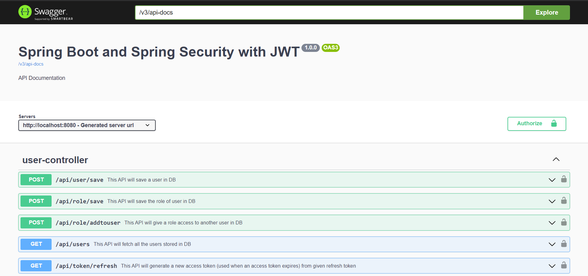
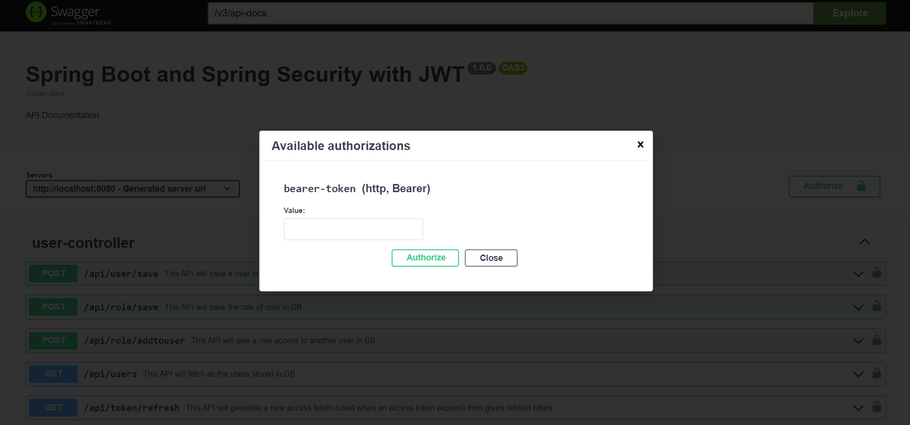

# SpringBOot

#### Role based user management system with JWT (access and refresh tokens) and Swagger-ui
##### (Covers all important concepts of spring boot)

<!-- Images -->

#### Dependencies used
* Spring Web
* Spring Security
* Spring Data Jpa
* Open API (Swagger-ui - for API Documentation)
* MySQL Driver
* java-jwt (provided by Auth0)
* Spring Boot DevTools

#### Extra Details
* For every Run, DB will delete and create Tables of User and Role from scratch (contains 4 users and 4 roles - used commandline runner)
* In the project, all APIs access given to ADMIN only
* can change this under securityConfig class

#### HOW Swagger-ui API Documentation works here?
* Shows all the REST APIs 
* Certain APIs need authorization, and access token should be given to those APIs by clicking the Authorize button
* Access and refresh tokens are created after login through url (... /api/login?username=example&password=123)
